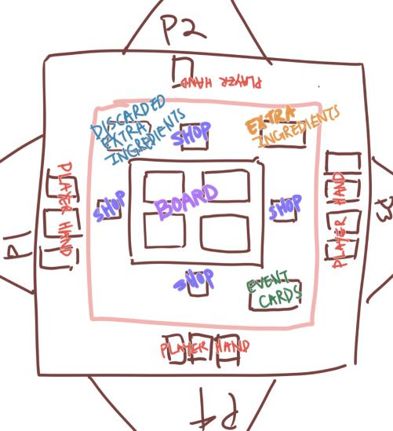

# Burger Kitchen by Zhi Zeng

When I think of regular traditional games, board games and table-top games instantly comes to my mind. This game that I created combines basic components from different existing board/table-top games in order to create a new unique and fun board game. Such elements includes the Card systems from the Uno game, and the Board systems from Monopoly. 

## Overview
In this game, you are a chef managing a burger kitchen. You compete with other players to become the best burger kitchen. The core objective is to collect essential ingredient cards from the different shops on the board. Once you have collected the four essential ingredients, you must return to your kitchen in order to "complete" a burger and earn points.

* Number of Players: 2-4 
* Theme: Burger Kitchen
* Materials Needed: Listed in "materials.md"
* How to Win: Collect ingredient cards and return to your kitchen to receive points, the first player to reach 100 wins.
* Hint: Go for extra ingredient tiles to receive extra points!

### Cards: 

There will be three different type of cards:

Essential Ingredient Cards (16 Cards) - Can ONLY be obtained when the player lands on the respective shop tiles. (Can be taken from other players)

There are 4 essential ingredients:
* Meat from the Butcher Shop (4) 
* Lettuce from the Veggie Shop (4)
* Cheese from the Cheese Shop (4)
* Bread from the Bakery (4) 

These Essential Ingredient cards can only be taken from other players if the player that takes does not have the card.

***

Extra Ingredient Cards (30 Cards in Total) - Can ONLY be obtained when players land on the extra ingredients tile. (Can be taken from other Players) 

There are 10 extra ingredients: *In parentheses is how many cards in the extra ingredients deck.
* Tomato - Worth +1 Points (5 cards)
* Pickle - Worth +2 Points (5 cards)
* Onion - Worth +3 Points (4 cards)
* Bacon - Worth +5 Points (3 cards)
* Extra Patty - Worth +10 Points (2 cards)
* Truffle - Worth +20 Points (1 card)
* Expired Bread - Worth -1 Points (5 cards)
* Moldy Cheese - Worth -3 Points (2 cards)
* Gross Tomato - Worth -5 Points (2 cards)
* Rotten Meat - Worth -10 Points (1 card)

NOTE: Any extra ingredient card (including moldy cheese, rotten meat, expired bread, extra patty) are NOT essential cards and CANNOT replace the essential cards that are required to complete a full burger. 
***
Event Cards (8 Cards) - Can ONLY be obtained when the players land on the SPECIAL CARD Tile. These cards cannot be taken from other players.

* * This card allows you to pick which ingredient to give another player if you are defeated in a duel. (3 cards)
* * * Condition: You are defeated in a duel. 

* * This card replaces one essential ingredient of your choice (3 cards)
* * * Condition: Can be used to replace ONE essential ingredient

* * This card sends one player of your choice back to their kitchen. (2 cards)

* * * Condition: Can be used on your turn before rolling dice.

## Setting Up the Game 

The above images show the setting of the table in Burger Kitchen. 

* There will be 3 main piles of cards: the Extra Ingredients Cards, Event Cards, and the discarded Extra Ingredients Pile. 
* The Extra Ingredient Cards and the Event Cards should be shuffled every game.
* The player's hands (representing what ingredients they currently own) will be revealed to other players. 
* The essential ingredients decks will be in front of their respective shops. 

### Game Board: 

## Gameplay & Rules

### Goal of the Game 
The goal of the game is to win by earning points through completing burgers by collecting the four essential ingredients and returning to the kitchen for points. 

### Win Condition: 
The player who reaches 100 points first will be the winner of the game. There will be no ties as it is turn-based. 

### Basic Gameplay: 
Player start the game on different corners across the board (Shown as A, B, C, D on the game board view.) This will represent the player's kitchen throughout the game. Other players cannot claim your kitchen.  

Players will roll dice to determine the order of moves. The player who rolls highest will move first, second highest second, etc. 

Players can move across the board by rolling 1 dice. The number it lands on is the number of tiles the player must move. The players will move starting clockwise. When the player comes across an intersection, they may choose any direction to move in except for the way that they came from. 

### Essential Ingredient Shops:

If the player lands on a SHOP tile, they will draw one card from the respective shop. 

If the player already has the ingredient from the shop that they land on. They CANNOT draw the card from the shop. 

### Extra Ingredient Tiles:

If the player lands on an INGREDIENT CARD tile, they will be allowed to draw one card from the Extra Ingredients deck. 

If the Extra Ingredient pile is empty and the discarded ingredients deck is not, the discarded ingredients deck must be shuffled and placed on the extra ingredients pile.. 

If both of the piles are empty, the player will not draw a card from the extra ingredients deck. 

### Event Cards
If the player lands on the SPECIAL CARD tile, they will be allowed to draw one card from the Event Card pile. 

If the player uses an event card once, the used event card will be placed at the end of the event card pile.

The event card must be used only when the conditions on the card are met.

### Kitchen
Once the players have one meat card, one lettuce card, one cheese card, and one bread card. They must return to THEIR OWN kitchen tile to receive points. 

Other players' kitchens will not be used to receive points. 

Once the player meets the condition of having one meat card, one lettuce card, one cheese card, and one bread card and on their kitchen tile. The player will receive points based on:
* The base points:  20 - players will receive 20 points everytime they complete a burger and return to their kitchen
* Extra points: * - these will be calculated based on which extra ingredients card the player have when completing the burger.

When the player receives points, the meat, lettuce, cheese, bread card will return to their respective shop decks. The extra ingredient cards will be placed in the discarded ingredients pile.

The points should be kept track of in a point sheet.

### Duels
If player A lands on player B on the board on their turn. Player A have the OPTION to initiate a duel. Player B cannot refuse the duel. 

The duel will be determined through a dice roll. Player A will roll first. 

If player B rolls equal or less than the amount of Player A's dice roll, Player A wins the duel.

If player B rolls higher than the amount of Player A's dice roll, Player B wins the duel.

The winner may pick an ingredients card from the loser's pile. 

The winner may only pick an ESSENTIAL INGREDIENT card if they do not have it in their hand.

