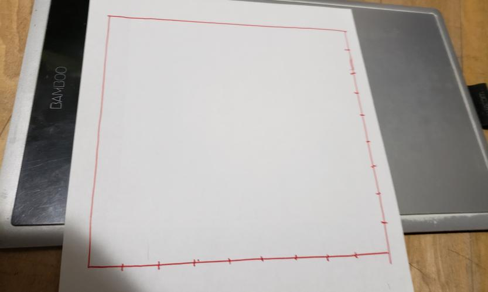
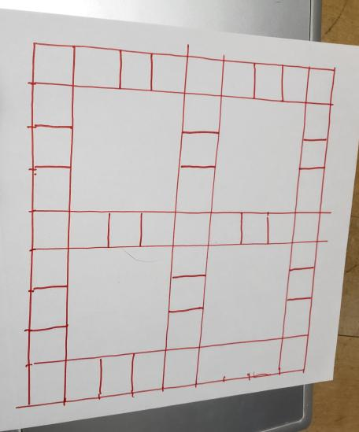
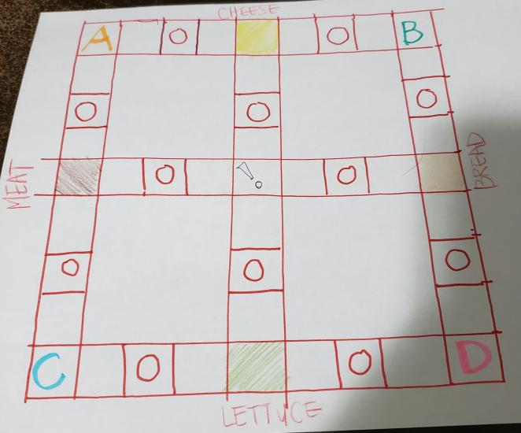
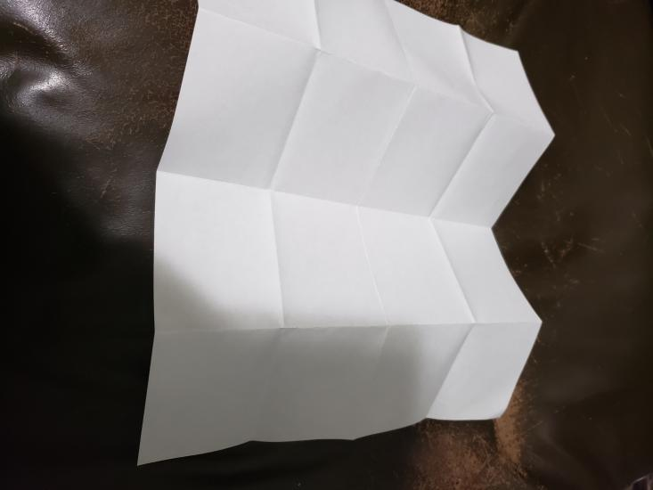
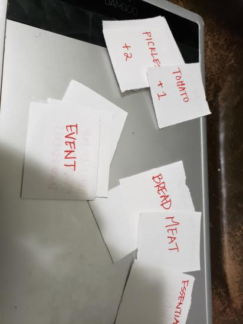

Make a list of all the materials needed to make your game.

# A List of Materials Needed

* 1 6-sided dice (or any object that is able to stimulate randomization from 1-6)
* 1 piece of paper for the BOARD 
* 1 pen
* 4 piece of paper for making the cards
* 1 piece of paper for tracking scores
* 1 ruler (OPTIONAL)
* 2-4 pieces of different color tokens to represent the players. ex. Starburst Candies.

## Drawing the Board:

Draw a square with 9x9 marks with the paper and pen:
##
Use a ruler for straight lines

Fill in the board as such: 

Label the board clearly as the game board view: 

* The position of the shops and players does not matter

## Creating Cards:

Fold 4 piece of paper 4 times across, and 4 times down to create 16 grids:

Cut these cards into 16 pieces, and label them as listed:

List of Event Cards (8 Cards) - Can ONLY be obtained when the players land on the SPECIAL CARD Tile. These cards cannot be taken from other players.

* * This card allows you to pick which ingredient to give another player if you are defeated in a duel. (3 cards)
* * * Condition: You are defeated in a duel. 

* * This card replaces one essential ingredient of your choice (3 cards)
* * * Condition: Can be used to replace ONE essential ingredient

* * This card sends one player of your choice back to their kitchen. (2 cards)

* * * Condition: Can be used on your turn before rolling dice.

You should have 54 cards in total. The cards should be labeled on both sides. The type of card on one side, and which card they are (meat/bread/tomato/etc) on the other side. 